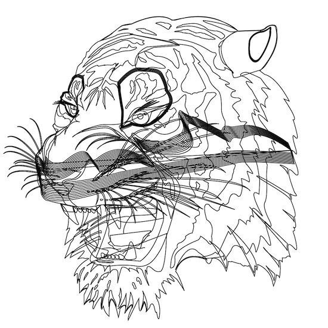

# svg2pl

*a tiny library to convert (reasonable subset of) svg to polylines*

- uses very little memory, 0 dynamic allocations
- single file, no dependencies other than C
- extremely fast
- no error checking -- assumes svg is perfectly valid, otherwise UB
- intended for compact projects or embeded systems

## supported svg features:

- transform attribute on all elements
- all path d= commands (beziers, arcs...)
- elements: g, path, line, polyline, polygon, circle, ellipse, rect, svg
- you can register custom parser functions for other tags (see usage)

## limitations:

- curves and ellipses are discretized
- fills and other styles are ignored,
  you can choose whether to skip all elements without "stoke" attribute
- viewBox and nested svg are supported, 
  but preserveAspectRatio can only be "xMidYMid meet"(default) or "none"
- percentage(%) and physical units are not supported
- JS, CSS and other crazy stuff are obviously not supported

## usage:
1. first define macros `S2P_MOVETO(x,y)` and `S2P_LINETO(x,y)`
   - these define what to do when the library has extracted polyline vertices
   - you can write to your own data structure, print, or control a machine, etc.
   - when not overwritten, these macros by default print the vertices to stdout.
2. (optional) define macro `S2P_SETDIM(w,h)`
   - this define what to do when the width/height of the svg are extracted
   - e.g. you might scale all subsequent vertices
3. `#include "svg2pl.c"`
4. (optional) call `s2p_def_tag` to register parsers for custom tags (e.g. `<text`)
5. call `s2p_parse_from_file` OR `s2p_parse_from_str` OR `s2p_parse (FILE*)`

## notes:
   - I use this library to control an axidraw plotter from a microcontroller, which reads svg files from an SD card -- a project I'll soon publish.
   - examples/hershey_text.c is a demo for adding custom parsers for text tags using hershey font. It is simplistic and only supports x, y, font-size, and an ascii string as content -- leaving out font styles, tspans, and all the other crazy stuff you can do in svg text -- it's just intended for showing how easily you can extend or customize svg2pl to support the features you need.
   - see the Makefile for more examples / usage hints

